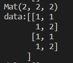
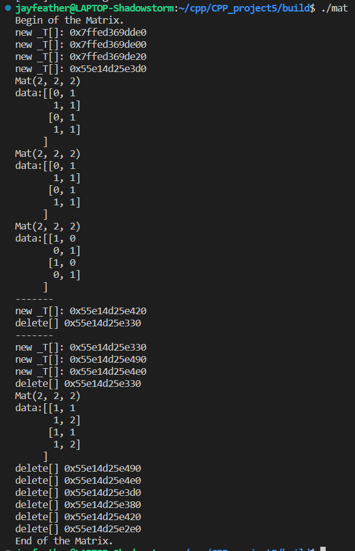

# CS205 C/ C++ - Matrix Class in C++

**Name**: 肖佳辰

**SID**: 12112012

## Part 1 - Analysis & Code

All the things I defined are in a `namespace`. So we can use `cs205::Mat` along with `cv::Mat`.

```cpp
namespace cs205
{
    //Exceptions
    class matrix_error : public std::logic_error{};
    
    //default converter
    template <typename _T1, typename _T2>
    struct __converter{};
    
    //The matrix
    template <typename _T>
    class Mat{};
}
```

### Definations

To design a c++ class for matrices, we need to store the matrix size, matrix data, ROI position and other informations.

```cpp
template <typename _T>
class Mat
{
private:
    // three dimention size of data. (d_col, d_row, d_depth)
    size_t d_col, d_row;
    // three dimention size of matrix. (col, row, depth)
    size_t col, row, depth;
    // upper left bound of the ROI matrix in data. (roi_col, roi_row, 0)
    size_t roi_col, roi_row;
    // data reference count
    size_t *refcount;
    // The data
    _T *data;
    
    //release the data
    void release();
    
    // No boundary check
    inline _T __getElement(const size_t dx, const size_t dy, const size_t dz = 0) const;
    inline void __setElement(const _T u, const size_t dx, const size_t dy, const size_t dz = 0) const;
    
public:
    //Assign two matrix together.
    Mat(const Mat<_T> &a);
    Mat &operator=(const Mat<_T> &a);
    //Create new matrix.
    Mat(const size_t row, const size_t col, const size_t dep = 1);
    Mat(const _T *data, const size_t row, const size_t col, const size_t dep = 1);
    
    ~Mat();
    
    //With boundary check
    _T getElement(const size_t dx, const size_t dy, const size_t dz = 0) const;
    _T setElement(const size_t dx, const size_t dy, const size_t dz = 0) const;
    
    //ostream output
    friend std::ostream &operator<<(std::ostream &os, const Mat<_T> &a);
    
    //Matrix operations like + - * ==
    template<typename _T2>
	Mat<decltype(std::declval<_T>() + std::declval<_T2>())> operator+(const Mat<_T2> &a) const;

	template<typename _T2>
	Mat<decltype(std::declval<_T>() - std::declval<_T2>())> operator+(const Mat<_T2> &a) const;

	template<typename _T2>
	Mat<decltype(std::declval<_T>() * std::declval<_T2>())> operator+(const Mat<_T2> &a) const;

	bool operator==(const Mat<_T> &a) const;
    
    
    //Clone a new matrix
    Mat clone() const;
    
    //create a submatrix.
    Mat subMatrixAssign(const size_t col, const size_t row, const size_t depth,
                        const size_t roi_col, const size_t roi_row) const;
    Mat subMatrixClone(const size_t col, const size_t row, const size_t depth,
                       const size_t roi_col, const size_t roi_row) const;
    
    //convert one type of matrix to another type.
    template <typename _T2, typename _Assign = __converter<_T2, _T>>
    Mat<_T2> convert()
};
```

Here I store a `refcount` to know how many times a matrix data has been used, and know the **correct time to release it**.

The `d_col`&`d_row` are the original size the data was alloced.

The `col`&`row`&`depth` are the ROI size that we are using.

The `roi_col`&`roi_row` are the ROI position in data.

To support different data types, I use a **template class** to acheive it.

Private functions are usually with no check, for faster.

### Create, Copy and Assign

We provide several ways to new or copy or assign a matrix.

By default, all the assign operators(`=` and assign constructor) will create a matrix that **share** the date with the original one.

If you want to create a new matrix with its own data, use `clone`.

#### Create a new matrix

Create a new matrix with constructor either empty or with initial data.

```cpp
//An empty matrix
Mat(const size_t row, const size_t col, const size_t dep = 1);
//a matrix with initial data
Mat(const _T *data, const size_t row, const size_t col, const size_t dep = 1);
```

In creating, user may alloc a very large of memory. We use `try-catch` to know if we created it well.

```cpp
try
{
    this->data = new _T[sz];
}
catch (std::bad_alloc &ba)
{
    fprintf(stderr, "Cannot malloc new matrix data. size:(%ld,%ld,%ld)\n", col, row, depth);
    std::cerr << ba.what() << std::endl;
}
```

#### Copy

Memory hard copy a new matrix.

```cpp
//clone a new matrix
void clone();
```

#### Assign

Assign two matrix together. Use the same data.

```cpp
//Assign two matrix together
Mat& operator=(const Mat<_T> &a);
//Assign two matrix together
Mat(const Mat<_T> &a)
```

To avoid unexpected issues, I check the variables.

If we do assign to itself, then nothing happen. If do assign to a matrix with orinial own data, then free it.

```cpp
if (this == &a)
    return *this;
if (this->data)
{
    release();
}
```

And since two variables are using the same data, we need to update `refcount`.

```cpp
if (this->refcount)
    ++(*(this->refcount));
```

Then we know how many variables are using it.

### functions

My matrix class can support several matrix operations like `+ - * ==`

To support **two different type** of matrix to do the operations, I do the following things.

```cpp
//decltype(): get the type inside the bracket.
decltype(std::declval<_T>() + std::declval<_T2>())
//This will get the correct type that should be returned.
```

```cpp
template<typename _T2>
Mat<decltype(std::declval<_T>() + std::declval<_T2>())> operator+(const Mat<_T2> &a) const;

template<typename _T2>
Mat<decltype(std::declval<_T>() - std::declval<_T2>())> operator-(const Mat<_T2> &a) const;

template<typename _T2>
Mat<decltype(std::declval<_T>() * std::declval<_T2>())> operator*(const Mat<_T2> &a) const;

bool operator==(const Mat<_T> &a) const;
```

Before these operations, I'll check the matrix size and data. If cannot operate, it will **throw an exception**.

```cpp
//Take operator+ as an example
if (a.get_col() != this->col || a.get_row() != this->row || a.get_depth() != this->depth)
{
    fprintf(stderr, "Invalid matrix plus. Dismatch matrix size.\n");
    throw matrix_error("Invalid matrix plus. Dismatch matrix size.");
}
if (this->data == NULL)
{
    fprintf(stderr, "Invalid matrix plus. NULL data.\n");
    throw matrix_error("Invalid matrix plus. NULL data.");
}
```

Because `float`&`double` cannot use `==` directly, so i use specifical functions to override it.

I find that it is not good to specify a function inside a template class, so I use several `if` to do it.

```cpp
if(typeid(_T)==typeid(float))
{
    ......
    if (abs(this->__getElement(i, j, k) - a.__getElement(i, j, k))>__FLT_EPSILON__)
    {
        return false;
    }
} else if(...){
    ...
}
```

And can use `cout` to output.

```cpp
friend std::ostream &operator<<(std::ostream &os, const Mat<_T> &a);
```

Example of output:



### Deconstructor

```cpp
~Mat()
{
    release();
}
void release()
{
    --(*(this->refcount));
    if (!(*this->refcount))//No one is using the data
    {
        if (data)
        {
            #ifdef __DEBUG__
            std::cout << "delete[] " << data << std::endl;
            #endif
            delete[] data;
        }
    }
}
```

### subMatrix

Input the submatrix's position and size, output a submatrix which is assigned/cloned.

```cpp
//ROI matrix size:(col, row, depth)
//ROI matrix position:(roi_col, roi_row, 0)

//Return a matrix with ROI in another matrix assigned.
Mat subMatrixAssign(const size_t col, const size_t row, const size_t depth,
                    const size_t roi_col, const size_t roi_row) const;
//clone a new submatrix.
Mat subMatrixClone(const size_t col, const size_t row, const size_t depth,
                   const size_t roi_col, const size_t roi_row) const;
```

Also check before operation.

```cpp
if (roi_col + col > this->col || roi_row + row > this->row || depth > this->depth)
{
    fprintf(stderr, "subMatrix is out of the original matrix's boundary!\n");
    throw std::out_of_range("subMatrix is out of the original matrix's boundary!");
}
```

### Convert

Sometimes we want to convert one type of matrix to another, so I write this.

```cpp
template <typename _T1, typename _T2>
struct __converter // The default converter.
{
    _T1 operator()(const _T2 a)
    {
        return static_cast<_T1>(a);
    }
};

template <typename _T2, typename _Assign = __converter<_T2, _T>>
Mat<_T2> convert();
```

It can convert a matrix with type `_T` to type `_T2`.

Usage examples:

```cpp
cs205::Mat<tp2> x(data1,1,1,1);
cs205::Mat<tp1> x1 = x.convert<tp1>();// Use the default converter
cs205::Mat<tp1> x2 = x.convert<tp1, my_converter>();// Use user-defined converter
```

## Part 3 - Result & Verification

- First is the matrix operation **correctness**.

  Using several random-generated matrix to do several operations and compare the result with `cv::Mat`.

  **All the result are correct**. (Within a range of $\dfrac{|a-b|}{max(1,min(a,b))*0.001}$)

  ~~Unfortunately, I deleted this part of code by mistake.~~

- Second is the **memory management**.

  With `-D__DEBUG__`, we can see how many matrix are alloced and how many are deleted.

  After tested all the operators and count the new&delete numbers, I can say that my programs will **not leak memory**.
  
  
  
- Also tested the `convert` function. It successfully convert between `struct st1{}` and `struct st2{}`.

## Part 4 - Difficulties & Solutions

1. How to **manage the memory** is a big question. I refered the method in OpenCV, and after many debugs, it finally work without error.
2. I want to support the matrix operations that have different types.(Like `Mat<int> + Mat<float>`) After searching through the Internet, I find `decltype()` to get the return type. This helps me to support different types operations.
3. I originally want to write a spesify function for matrix multiply in `int&float&double`. But since the matrices are not aligned in the most time(When come with ROI, it get messier.), I eventually discard it, only using the fastest plain method.(But with -O3, it can run very fast.)
4. I have a usage example in test.cpp. Welcome to read.
